# OGC 2026 조선소 블록 배치 문제의 최적화 문헌 심층조사

## 요약

제공된 OGC 2026 PDF는 조선소의 여러 bay에 대해 각 블록의 **배정 bay, 평면 위치, 방향, ENTRY 시점, EXIT 시점**을 동시에 결정해야 하는 **시공간 통합 최적화 문제**를 정의한다. 이 문제는 단순한 병렬기계 스케줄링이 아니라, **불규칙 다각형의 다층 배치**, **release date·processing time·due date**, **same-layer collision-free**, **crane 접근 가능성**, **workload imbalance**, **bay preference**를 한꺼번에 다루는 점에서 훨씬 복합적이며, PDF의 목적함수도 총 지연, bay 간 작업부하 불균형, 선호도 손실의 가중합으로 설계되어 있다. fileciteturn0file0

수집한 1차 문헌을 종합하면, 이 문제와 가장 직접적으로 맞닿는 연구 축은 네 갈래다. 첫째는 **berth allocation / yard planning** 계열의 시간-공간 배정 연구, 둘째는 **irregular nesting / irregular strip packing** 계열의 불규칙 형상 배치 연구, 셋째는 **dynamic storage allocation** 계열의 입·출고 점유 관리 연구, 넷째는 **integrated packing–placement–scheduling** 계열의 통합 생산계획 연구다. 검색된 survey와 primary source들을 종합하면, OGC 문제는 이 네 축의 교차점에 있으나, **“다층 불규칙 블록 + bay 배정 + ENTRY/EXIT 타이밍 + 크레인 출입 가능성 + workload/preference 목적”**을 동시에 모델링한 공개 1차 문헌은 매우 드물어 보이며, 이 점이 이번 과제의 연구적 난점이자 기회로 해석된다. 이는 문헌 종합에 근거한 해석이다. citeturn30search0turn34search2turn29search0turn14academia2turn39academia3turn31academia0turn21academia0

본 보고서는 PDF에서 문제를 수학적으로 재정식화하고, 직접 관련성이 높은 문헌을 **분류 체계·survey**, **공간-시간 배정 및 항만/야드 유사문제**, **불규칙 형상 배치 및 최근 exact/learning 계열**로 정리했다. 또한 한국 연구자 저작으로 확인되는 **Park–Kim**, **Kim–Moon** 계열의 berth scheduling 논문도 우선 포함해, 요청한 “한국계 자료 우선” 조건에 최대한 부합하도록 구성했다. citeturn35search0turn29search0turn19search0

## PDF에서 추출한 최적화 문제와 수식

PDF의 핵심은 각 블록 \(i\)에 대해 **단 하나의 bay 배정**, **정수 좌표 \((x_i,y_i)\)**, **유한한 방향 선택 \(o_i\)**, **ENTRY/EXIT 시점**, 그리고 그 결과로 결정되는 **지연 \(T_i\)**를 함께 정하는 것이다. 블록은 여러 polygonal layer로 이루어진 3차원 구조이지만, 실질적인 배치 판정은 **같은 level의 layer끼리 interior intersection이 없는지**와, 크레인 출입 시에는 **상위 layer와의 간섭도 없는지**를 확인하는 방식으로 주어진다. 또한 하루의 작업 순서는 항상 **EXIT 후 ENTRY**여야 하며, baseline은 **EDD + AABB candidate point + 사후 repair**를 사용한다고 설명한다. fileciteturn0file0

이 문제를 문헌형 수리모형으로 압축하면 다음과 같이 쓸 수 있다. 여기서 \(a_{ij}\in\{0,1\}\)는 블록 \(i\)가 bay \(j\)에 배정되었는지, \(s_i,e_i\)는 ENTRY/EXIT, \(o_i\)는 방향, \((x_i,y_i)\in\mathbb Z^2\)는 reference point의 정수 위치, \(T_i\)는 tardiness를 뜻한다. 아래 식은 PDF의 정의를 콤팩트하게 재서술한 것이다. fileciteturn0file0

\[
\min \; w_1\sum_{i\in N}T_i
\;+\;
w_2\max_{j_1\neq j_2}
\left|
u_{j_1}\sum_{i\in N}L_i a_{ij_1}
-
u_{j_2}\sum_{i\in N}L_i a_{ij_2}
\right|
\;+\;
w_3\sum_{i\in N}\sum_{j\in M}(S_i^{\max}-S_{ij})a_{ij}
\]

subject to

\[
\sum_{j\in M} a_{ij}=1 \qquad \forall i\in N
\]

\[
s_i \ge R_i,\qquad e_i-s_i\ge P_i,\qquad
T_i\ge e_i-D_i,\qquad T_i\ge 0
\qquad \forall i\in N
\]

\[
\text{Containment}\big(P^{o_i,x_i,y_i}_{i,\ell},\, \text{bay}(j)\big)=1
\quad \forall i,\ell \text{ with } a_{ij}=1
\]

\[
\text{If } [s_i,e_i)\cap[s_k,e_k)\neq\emptyset
\text{ and } a_{ij}=a_{kj}=1,\;
\text{then }
\operatorname{int}(P^{o_i,x_i,y_i}_{i,\ell})
\cap
\operatorname{int}(P^{o_k,x_k,y_k}_{k,\ell})=\emptyset
\]

\[
\text{If day } t \text{ has ENTRY/EXIT of } i,\;
\text{then crane-feasibility requires no collision between layer } \ell_1
\text{ of } i
\text{ and any same-or-higher layer } \ell_2 \text{ of active block } k.
\]

PDF에서 추출되는 최적화 키워드는 다음과 같이 정리된다. **shipyard block scheduling, bay assignment, irregular polygon packing, layered 3D block placement, discrete orientation set, continuous-with-integer-anchor placement, same-layer collision-free feasibility, crane accessibility/removability, release date, due date, processing time, tardiness minimization, workload balancing, preference penalty, weighted-sum multiobjective optimization, daily operation sequencing, EDD heuristic, AABB candidate points, feasibility repair, numerical robustness, collision detection**가 핵심이다. 특히 page 5의 Figure 7은 **bay containment**, **layer collision-free**, **crane operation violation**의 차이를 직접 보여주고, page 8의 Figure 8은 방향에 따라 reference point의 상대적 위치가 달라진다는 사실을 강조한다. fileciteturn0file0

문헌 대응 관점에서 보면 이 수식은 다음 네 계열로 분해된다. **bay와 시간의 동시 배정**은 berth allocation/yard planning, **불규칙 다각형의 containment와 non-overlap**은 nesting/irregular strip packing, **ENTRY–EXIT 기반 점유구간**은 dynamic storage allocation, **지연·균형·선호의 다목적 구조**는 scheduling/assignment literature와 맞닿는다. OGC는 이들을 단순 병렬 연결이 아니라 하나의 feasibility set으로 접합한다는 점에서 더 어렵다. citeturn29search0turn14academia2turn39academia3turn31academia0turn21academia0

## 관련 문헌 지형도

분류 체계 연구는 OGC를 어디에 놓아야 하는지 결정하는 데 중요하다. Dyckhoff의 고전적 typology와 Wäscher–Haußner–Schumann의 개선된 typology는 cutting/packing 문제를 item assortment, assignment pattern, large-object structure, output composition 등으로 분류하고, strip packing 같은 open-dimension 문제와 bin-packing류 문제의 차이를 명확히 한다. OGC는 이 분류에 그대로 들어맞기보다, **open-dimension/continuous-placement/temporal-compatibility**가 섞인 하이브리드 문제로 보는 편이 정확하다. citeturn19search0turn30search0turn34search0turn34search2

항만·야드 계열 연구는 OGC의 **bay–time 배정 구조**를 이해하는 데 유용하다. 동적 berth allocation, continuous location space, tabu search, set partitioning, robust optimization 등은 모두 “공간 위치와 시간을 동시에 배정”한다는 공통점을 갖고 있으며, 특히 Imai 계열과 Cordeau 계열 문헌은 OGC의 bay-occupancy 해석과 가장 유사하다. Belov 등의 cargo assembly planning은 stockyard 공간과 시간, 그리고 후속 하역 일정까지 함께 고려한다는 점에서 OGC와 가장 가까운 실무 인접문헌 중 하나다. citeturn29search0turn35search0turn14academia2turn8search4

불규칙 형상 계열 연구는 OGC의 기하학적 핵심을 담당한다. NFP, separation line, conflict graph, clique covering, collision-detection engine, branch-and-bound-and-prune, geometry-aware RL 등은 모두 **다각형의 containment와 pairwise non-overlap**를 계산하거나 탐색공간을 줄이는 기술이며, 최근 exact literature는 특히 **MILP formulation 강화**와 **geometry/or-optimization 분리**에 집중하고 있다. OGC의 page 7–8이 수치오차와 정수 anchor, fractional vertex를 별도로 경고하는 이유도 바로 이 계열의 난점과 일치한다. citeturn39academia2turn39academia1turn22academia1turn39academia3turn30academia6turn26academia3turn39academia0turn0file0

동적 storage allocation과 integrated production planning은 OGC의 ENTRY/EXIT 논리를 보완한다. Ernst–Stolyar는 first-fit 동적 배치의 점근 최적성 문제를 다루어 시간에 따라 들어오고 나가는 아이템의 점유 패턴을 이론적으로 조명했고, Korladinov 등은 packing–placement–scheduling–routing을 하나의 생산 파이프라인으로 엮었다. OGC의 crane constraint는 단순 점유가 아니라 **“나갈 수 있어야 하는” 접근가능성 제약**을 요구하므로, 이 계열과 retrieval/blocking 문제 문헌을 함께 보는 것이 자연스럽다. citeturn31academia0turn21academia0

검색된 주요 survey와 1차 논문을 종합하면, 공개 문헌은 대체로 **공간-시간 배정**과 **불규칙 형상 배치**를 별도 하위문제로 다루고, 접근가능성·층간 간섭·선호/균형 목적까지 한 모델에 얹는 경우는 드물다. 따라서 OGC에 대해 가장 설득력 있는 해법은 단일 monolithic 모델만 고집하기보다, **master assignment/scheduling + geometry feasibility oracle + accessibility repair/penalty + 대형이웃탐색 또는 decomposition**의 구조일 가능성이 높다. 이는 기존 문헌의 범위와 OGC 명세를 결합한 해석이다. citeturn29search0turn14academia2turn39academia3turn30academia6turn26academia3turn21academia0turn0file0

## 핵심 수학 개념의 네 문장 요약

목적함수는 총 지연벌점, 면적가중 workload 불균형, 배정 선호도 손실을 가중합하거나 다목적 계층화로 묶는 형태가 공통적이다. fileciteturn0file0  
제약식은 release date·processing time·due date 같은 시간제약과, 불규칙 다각형의 containment·non-overlap·layer-wise interference·접근가능성 제약을 동시에 다루기 위해 NFP, separation line, 충돌판정 오라클, 점유구간 모델을 결합한다. citeturn39academia1turn39academia2turn30academia6turn0file0  
해법은 MILP·MINLP·CP·branch-and-price·branch-and-bound-and-prune·tabu search·simulated annealing·LNS·하이브드 휴리스틱의 조합으로 발전해 왔다. citeturn30academia7turn14academia2turn35search0turn26academia3turn21academia0  
이론적으로는 2차원 다각형 포장 feasibility의 \(\exists\mathbb{R}\)-완전성, 동적 first-fit의 점근최적성, 그리고 exact formulation의 강화된 valid inequality 및 pruning 구조가 핵심 보장으로 등장한다. citeturn22academia1turn31academia0turn39academia3turn26academia3

## 직접 관련 문헌 카탈로그

시스템 제약상 원시 URL은 직접 쓰지 않고, **DOI 텍스트·arXiv 식별자** 또는 **인용 링크**로 제시했다. 저널 논문의 웹 열람은 각 행의 인용을 통해 접근할 수 있다.

### 분류 체계와 survey 문헌

| 제목 | 저자 | 연도·게재처 | DOI/식별자 | 짧은 초록 요약 | 왜 관련한가 | 근거 |
|---|---|---|---|---|---|---|
| *A typology of cutting and packing problems* | Harald Dyckhoff | 1990, *European Journal of Operational Research* 44(2) | 인용 링크 | 절단·포장 문제를 체계적으로 유형화한 고전 논문으로, 이후의 모델링 언어를 정착시켰다. 문제를 “무엇을 어디에 어떤 구조로 배치하느냐”로 분해한다. | OGC를 기존 packing 계열 어디에 놓을지 판단하는 출발점이다. | citeturn19search0turn30search3 |
| *An improved typology of cutting and packing problems* | Gerhard Wäscher, Heike Haußner, Holger Schumann | 2007, *European Journal of Operational Research* 183(3) | DOI 텍스트 확인 가능, 웹은 인용 참조 | 기존 typology를 개선해 open dimension, strip packing, bin packing, assortment 차이를 정교하게 구분한다. | OGC의 “bay는 고정 크기인데 시간과 위치를 동시에 결정”하는 혼합적 성격을 설명할 때 가장 자주 인용되는 분류축이다. | citeturn30search0turn34search0turn34search1 |
| *Two-dimensional packing problems: A survey* | Andrea Lodi, Silvano Martello, Michele Monaci | 2002, *European Journal of Operational Research* 141 | 인용 링크 | 2차원 packing의 주요 문제형, 근사/휴리스틱/정확알고리즘을 넓게 정리한 survey다. | OGC의 공간 배치 부분을 직사각형·strip·bin 계열과 비교해 볼 수 있게 해 주는 기본 survey다. | citeturn34search2turn17search3 |
| *Container terminal operation and operations research – a classification and literature review* | Dirk Steenken, Stefan Voß, Robert Stahlbock | 2004, *OR Spectrum* 26 | 인용 링크 | 컨테이너 터미널의 배정·스케줄링·장비운영을 OR 관점에서 분류한 리뷰다. | OGC의 bay 운영을 berth/quay/yard literature와 연결해 주는 가장 유용한 survey 중 하나다. | citeturn29search1turn29search0 |
| *Exact Solution Techniques for Two-dimensional Cutting and Packing* | Manuel Iori, Vinícius L. de Lima, Silvano Martello, Flávio K. Miyazawa, Michele Monaci | 2020, arXiv preprint | `arXiv:2004.12619` | 2차원 절단·포장의 exact formulation과 relaxation을 정리한 survey로, 주로 orthogonal case의 수리모형을 비교한다. | OGC에 exact master model을 설계할 때 extended formulation, relaxation, decomposition 아이디어를 차용하기 좋다. | citeturn30academia7 |
| *Constraint programming methods in three-dimensional container packing* | Szymon Wróbel | 2023, arXiv preprint | `arXiv:2311.06314` | 3차원 container packing의 변형과 CP 접근을 정리한 최근 survey다. | OGC의 “layered 3D block”을 완전 3D packing과 비교해 보고 CP의 역할을 판단하는 데 유익하다. | citeturn30academia5 |

### 공간-시간 배정과 항만·야드 유사문헌

| 제목 | 저자 | 연도·게재처 | DOI/식별자 | 짧은 초록 요약 | 왜 관련한가 | 근거 |
|---|---|---|---|---|---|---|
| *The dynamic berth allocation problem for a container port* | Akio Imai, Etsuko Nishimura, Stavros Papadimitriou | 2001, *Transportation Research Part B* 35 | 인용 링크 | 선박의 시간-공간 berth 배정을 동적으로 다루는 대표 논문이다. | OGC의 bay occupancy interval과 가장 닮은 시간-공간 배정의 고전적 출발점이다. | citeturn29search0turn35search0 |
| *A multiprocessor task scheduling model for berth allocation: heuristic and worst case analysis* | Yongpei Guan, W.-Q. Xiao, Raymond K. Cheung, C.-L. Li | 2002, *Operations Research Letters* 30 | 인용 링크 | berth allocation을 multiprocessor scheduling 관점으로 모델링하고 휴리스틱과 최악경계 분석을 제시한다. | OGC의 bay를 “공유 가능한 processor/resource”처럼 보는 관점을 제공한다. | citeturn29search0turn35search0 |
| *Berth scheduling for container terminals by using sub-gradient optimization techniques* | K. T. Park, K. H. Kim | 2002, *Journal of the Operational Research Society* 53 | 인용 링크 | 한국 연구자에 의한 berth scheduling 논문으로, sub-gradient 기반 최적화 기법을 사용한다. | bay-time assignment의 large-scale relaxation 아이디어를 참고하기 좋고, 한국계 직접 관련 문헌이라는 점도 중요하다. | citeturn29search0turn35search0 |
| *Berth scheduling by simulated annealing* | K. H. Kim, K. C. Moon | 2003, *Transportation Research Part B* 37 | 인용 링크 | 시뮬레이티드 어닐링으로 berth scheduling을 푸는 고전 메타휴리스틱 논문이다. | OGC처럼 exact+geometry가 무거운 문제에서 metaheuristic outer loop를 설계할 때 직접적 참고가 된다. | citeturn29search0turn35search0 |
| *Berth Allocation in a Container Port: Using Continuous Location Space Approach* | Akio Imai, Xiaojun Sun, Etsuko Nishimura, Stavros Papadimitriou | 2005, *Transportation Research Part B* 39 | 인용 링크 | berth 위치를 이산 berth가 아니라 연속 위치공간으로 모델링한다. | OGC의 bay 내부 연속 위치결정과 가장 직접적으로 닮은 아이디어다. | citeturn29search0turn15search0 |
| *Models and tabu search heuristics for the berth-allocation problem* | Jean-François Cordeau, Gilbert Laporte, Pasquale Legato, Luigi Moccia | 2005, *Transportation Science* 39 | 인용 링크 | 여러 berth-allocation 정식화와 tabu search를 결합해 계산 성능을 높인다. | OGC에서도 geometry oracle을 둔 뒤 tabu/LNS 계열 상위 탐색을 붙일 수 있음을 시사한다. | citeturn29search0turn15search0 |
| *Exact and heuristic methods to solve the berth allocation problem in bulk ports* | Nikhil Umang, Michel Bierlaire, Ivana Vacca | 2013, *Transportation Research Part E* 54 | 인용 링크 | bulk port 환경에서 exact와 heuristic 방법을 함께 비교한 논문이다. | shipyard·yard 문제와 유사한 중후장대 산업 맥락에서 hybrid 접근의 실효성을 보여 준다. | citeturn29search0 |
| *Integrated Berth Allocation and Quay Crane Assignment Problem: Set partitioning models and computational results* | C. Iris, D. Pacino, S. Ropke, A. Larsen | 2015, *Transportation Research Part E* 81 | 인용 링크 | berth와 quay crane 결정을 set partitioning으로 통합한 대표 논문이다. | OGC의 bay 배정과 crane feasibility를 통합해 보려는 모델링에 가장 직접적인 구조적 힌트를 준다. | citeturn29search0 |
| *Exploration of models for a cargo assembly planning problem* | G. Belov, N. Boland, M. W. P. Savelsbergh, P. J. Stuckey | 2015, arXiv preprint | `arXiv:1504.00445` | 석탄 공급망의 stockyard에서 cargo를 조립하는 실제 planning 문제를 MiniZinc CP와 LNS로 다룬다. optional constraint를 켜고 끄며 시스템 수준 확장을 비교한다. | 야드 공간과 시간, 후속 공정 연결을 함께 고려한다는 점에서 OGC와 가장 가까운 실무 인접문헌이다. | citeturn14academia2 |
| *Robust optimization for the integrated berth allocation and quay crane assignment problem* | C. Wang, L. Miao, C. Zhang, T. Wu, Z. Liang | 2023, *Naval Research Logistics* | DOI `10.1002/nav.22159` | 통합 berth–quay crane 문제에 robust optimization을 도입해 불확실한 작업환경을 다룬다. | OGC의 hidden instance와 실행시간 제한 환경에서 robust planning이 왜 유의미한지 보여 주는 최근 사례다. | citeturn29search0turn8search4 |
| *Asymptotic optimality of dynamic first-fit packing on the half-axis* | Philip Ernst, Alexander Stolyar | 2024, arXiv preprint | `arXiv:2404.03797` | 동적 storage allocation에서 first-fit의 점근 최적성을, 일부 비퇴화 분포까지 확장해 증명한다. | OGC의 ENTRY–EXIT에 따른 bay 점유 관리와 “먼저 들어온 feasible 위치에 놓기” 류 규칙의 이론적 배경을 제공한다. | citeturn31academia0 |
| *Integrated packing, placement, scheduling, and routing of personalized production: a pharmaceutical Industry 4.0 use-case with a planar transport system* | Viktor Emil Korladinov, Antonin Novak, Zdeněk Hanzálek, Erik Sonntag, František Štěpánek | 2026, arXiv preprint | `arXiv:2604.21029` | tactical level의 packing/placement와 operational level의 scheduling/routing을 MIQP·CP·DAG reasoning으로 결합한다. | OGC를 “배치-스케줄-이동가능성”의 통합 pipeline으로 구현할 때 가장 현대적인 비교대상이다. | citeturn21academia0 |

### 불규칙 형상 배치와 최근 exact·geometry 문헌

| 제목 | 저자 | 연도·게재처 | DOI/식별자 | 짧은 초록 요약 | 왜 관련한가 | 근거 |
|---|---|---|---|---|---|---|
| *Solving Irregular Strip Packing Problems With Free Rotations Using Separation Lines* | Jeinny Peralta, Marina Andretta, José Fernando Oliveira | 2017, arXiv preprint | `arXiv:1707.07177` | 자유회전이 가능한 불규칙 strip packing을 separation line 기반 비선형모형으로 풀고 IPOPT로 계산한다. | OGC의 orientation decision과 non-overlap을 직접 다루는 대표적 1차 문헌이다. | citeturn39academia2 |
| *Robust NFP generation for Nesting problems* | Pedro Rocha | 2019, arXiv preprint | `arXiv:1903.11139` | 불규칙 nesting의 핵심인 NFP 생성을 단순하면서도 수치적으로 강건하게 수행하는 방법을 제안한다. | OGC PDF가 강조한 수치안정성 문제와 geometry engine의 중요성을 정확히 겨냥한다. | citeturn39academia1turn0file0 |
| *Framework for \(\exists \mathbb{R}\)-Completeness of Two-Dimensional Packing Problems* | Mikkel Abrahamsen, Tillmann Miltzow, Nadja Seiferth | 2020, arXiv preprint | `arXiv:2004.07558` | 다양한 2D packing feasibility가 \(\exists\mathbb{R}\)-완전임을 보이는 일반 프레임워크를 구축한다. | OGC의 형상 feasibility가 왜 근본적으로 어려운지에 대한 이론적 하한을 제공한다. | citeturn22academia1 |
| *A new mixed-integer programming model for irregular strip packing based on vertical slices with a reproducible survey* | Juan J. Lastra-Díaz, M. Teresa Ortuño | 2022, arXiv preprint | `arXiv:2206.00032` | NFP covering model을 vertical slices로 강화한 연속 MILP family를 제안하고, 재현가능한 survey를 함께 제공한다. | irregular packing exact model의 최근 기준점으로, OGC의 geometry subproblem을 MILP로 근사·분해할 때 핵심 참조가 된다. | citeturn39academia3turn22academia0 |
| *A heuristic for solving the irregular strip packing problem with quantum optimization* | Paul-Amaury Matt, Marco Roth | 2024, arXiv preprint | `arXiv:2402.17542` | irregular strip packing을 순서결정과 공간배치의 두 하위문제로 나누고 양자/양자영감 휴리스틱을 적용한다. | OGC에서도 블록 순서와 위치를 분리하는 decomposition이 유효함을 보여 주는 최근 사례다. | citeturn21academia2 |
| *Decoupling Geometry from Optimization in 2D Irregular Cutting and Packing Problems: an Open-Source Collision Detection Engine* | Jeroen Gardeyn, Tony Wauters, Greet Vanden Berghe | 2025, arXiv preprint | `arXiv:2508.08341` | geometry와 optimization을 분리하는 collision detection engine을 제안해, 사용자는 geometry oracle 위에서 알고리즘을 설계할 수 있게 한다. | OGC처럼 geometry 판정이 복잡한 문제에 가장 실용적인 소프트웨어 구조를 제시한다. | citeturn30academia6 |
| *A parallel branch-and-bound-and-prune algorithm for irregular strip packing with discrete rotations* | Juan J. Lastra-Díaz, M. Teresa Ortuño | 2025, arXiv preprint | `arXiv:2503.21009` | discrete rotation irregular packing을 위해 preprocessing 비용을 줄인 병렬 branch-and-bound-and-prune exact algorithm을 제안하고 open instance들을 추가로 최적화한다. | OGC가 제공하는 finite orientation set과 잘 맞고, hidden instance용 exact subsolver 후보로 유력하다. | citeturn26academia3 |
| *Geometry-Aware Reinforcement Learning for 2D Irregular Nesting* | Auguste Lehuger, Guillaume Henon-Just | 2026, arXiv preprint | `arXiv:2606.10611` | polygon geometry를 직접 인코딩하는 transformer와 RL을 결합해 irregular nesting을 푼다. | OGC의 orientation·placement 결정을 학습기반으로 다루려는 2026년 최신 흐름을 보여 준다. | citeturn39academia0 |

## 핵심 논문 비교

아래 비교표는 OGC와의 구조적 유사성이 큰 논문들을 골라, **문제유형–모델–알고리즘–복잡도/해법 성격–핵심 결과**로 정리한 것이다. OGC 전체를 그대로 푼 논문은 아니지만, 실제 알고리즘 설계에서는 이 표의 조합이 가장 유용하다. citeturn29search0turn14academia2turn39academia3turn31academia0turn21academia0

| 논문 | 문제유형 | 모델 | 알고리즘 | 복잡도·해법 성격 | 주요 결과 | 근거 |
|---|---|---|---|---|---|---|
| Imai et al. 2001 | 동적 berth allocation | 시간–공간 배정 모형 | 수리계획 기반 해법 | NP-난해 계열의 공간-시간 배정 | 동적 도착을 갖는 위치+시간 배정의 표준 참조점 형성 | citeturn29search0 |
| Guan et al. 2002 | berth allocation–scheduling 연결 | multiprocessor scheduling model | heuristic + worst-case analysis | scheduling 관점으로 재해석 | berth 문제를 processor scheduling으로 보는 틀 제시 | citeturn35search0 |
| Kim & Moon 2003 | berth scheduling | 공간-시간 배정 | simulated annealing | 메타휴리스틱 | 대규모 배정 문제에서 SA의 실용성 제시 | citeturn35search0 |
| Cordeau et al. 2005 | berth allocation | 수리모형 + neighborhood 구조 | tabu search | 휴리스틱 고도화 | 여러 모델 변형에 대해 강한 계산성능 제시 | citeturn29search0 |
| Belov et al. 2015 | cargo assembly planning | MiniZinc CP + optional constraints | LNS + adaptive greedy | 실무형 CP/LNS | stockyard planning에서 시스템 제약을 켜고 끄며 비교 | citeturn14academia2 |
| Peralta et al. 2017 | irregular strip packing with free rotations | 비선형 separation-line model | IPOPT | 비선형 continuous optimization | 자유회전 불규칙 packing을 직접 최적화 | citeturn39academia2 |
| Abrahamsen et al. 2020 | 2D polygon packing feasibility | 복잡도 프레임워크 | reduction proofs | \(\exists\mathbb{R}\)-complete | polygon packing feasibility의 근본 난이도 규명 | citeturn22academia1 |
| Lastra-Díaz & Ortuño 2022 | irregular strip packing exact model | NFP-CM-VS MILP | exact MILP + valid inequalities | 강화된 formulation | 기존 MIP 대비 더 강한 exact family 제안 | citeturn22academia0turn39academia3 |
| Wang et al. 2023 | integrated berth + quay crane under uncertainty | robust optimization model | exact/robust optimization | 불확실성 대응 | 통합 배정 문제에 robustness를 체계 도입 | citeturn8search4turn29search0 |
| Ernst & Stolyar 2024 | dynamic storage allocation | 확률적 packing model | 이론 분석 | 점근최적성 증명 | 동적 first-fit의 이론적 성질 강화 | citeturn31academia0 |
| Lastra-Díaz & Ortuño 2025 | irregular strip packing with discrete rotations | DB 계열 exact reformulation | parallel branch-and-bound-and-prune | exact + pruning | 17개 open instance 추가 최적화 | citeturn26academia3 |
| Korladinov et al. 2026 | integrated packing–placement–scheduling–routing | MIQP + assignment + CP + DAG reasoning | hybrid pipeline | tactical+operational integration | packing과 scheduling을 한 생산 파이프라인으로 연결 | citeturn21academia0 |

OGC에 바로 옮겨오면, **master problem**은 Imai/Cordeau/Iris/Wang 계열처럼 bay–time 배정을 담당하고, **geometry oracle**은 Rocha/Gardeyn/Lastra 계열이 맡으며, **접근가능성·repair**는 Belov·Ernst·메타휴리스틱 계열이 흡수하는 3층 구조가 가장 그럴듯하다. 이 조합은 정확한 global optimality를 항상 보장하지는 않지만, competition setting의 wall-clock 제한과 hidden instances를 고려하면 가장 현실적인 설계다. 이는 상기 문헌의 조합에 근거한 설계 해석이다. citeturn14academia2turn30academia6turn26academia3turn31academia0turn29search0turn21academia0

## 발전 연표와 모델링 파이프라인

문헌 발전 흐름을 시간축으로 그리면, **분류 체계 정립 → berth/yard의 시간–공간 배정 → irregular geometry의 exact화 → geometry engine 분리 → 통합 planning pipeline**으로 이동한다고 볼 수 있다. OGC는 이 마지막 단계, 즉 여러 하위문헌을 실질적으로 합쳐야 하는 지점에 놓여 있다. citeturn19search0turn30search0turn29search0turn14academia2turn39academia3turn30academia6turn21academia0

```mermaid
timeline
    title OGC와 직접 관련된 최적화 연구의 주요 전개
    1990 : Dyckhoff<br/>cutting & packing typology 정립
    2001 : Imai et al.<br/>dynamic berth allocation
    2002 : Guan et al.<br/>berth를 scheduling으로 재해석
    2002 : Park & Kim<br/>sub-gradient berth scheduling
    2003 : Kim & Moon<br/>simulated annealing berth scheduling
    2004 : Steenken et al.<br/>container terminal OR review
    2005 : Imai et al.<br/>continuous location space berth model
    2005 : Cordeau et al.<br/>tabu search for berth allocation
    2015 : Belov et al.<br/>cargo assembly planning with CP/LNS
    2015 : Iris et al.<br/>integrated berth + quay crane
    2017 : Peralta et al.<br/>separation-line irregular packing
    2019 : Rocha<br/>robust NFP generation
    2020 : Abrahamsen et al.<br/>packing feasibility의 ∃R-completeness
    2022 : Lastra-Díaz & Ortuño<br/>vertical-slice MILP for irregular packing
    2023 : Wang et al.<br/>robust integrated berth/quay assignment
    2024 : Ernst & Stolyar<br/>dynamic first-fit asymptotic optimality
    2025 : Gardeyn et al.<br/>geometry engine 분리
    2025 : Lastra-Díaz & Ortuño<br/>parallel B&B&P with discrete rotations
    2026 : Korladinov et al.<br/>packing→placement→scheduling pipeline
    2026 : Lehuger & Henon-Just<br/>geometry-aware RL nesting
```

OGC용 모델링→해결 파이프라인은 아래처럼 정리하는 것이 가장 자연스럽다. 여기서 핵심은 **geometry를 독립 오라클로 두고**, 상위에서는 **배정·시간 의사결정**을 탐색하며, 하위에서는 **containment/non-overlap/crane feasibility**를 강건하게 검사하는 것이다. citeturn30academia6turn39academia1turn39academia3turn14academia2turn21academia0turn0file0

PDF의 규칙을 충실히 따르려면, 구현 수준에서는 특히 세 가지가 중요하다. 첫째, **정수 anchor와 fractional vertex**가 함께 존재하므로, 최종 feasibility check는 OGC utils와 동일한 수치판정 규칙을 따라야 한다. 둘째, **crane constraint**는 단순 overlap 검사가 아니라 “현재 점유 중인 다른 블록의 상위 layer까지 고려한 출입 가능성”이므로, static nesting보다 더 강한 판정 오라클이 필요하다. 셋째, 목적함수의 \(Z_2\)는 pairwise max imbalance라서 단순 선형합보다 다루기 까다롭기 때문에, 실전에서는 보조변수로 상계화하거나 lexicographic/Lagrangian 형태로 다루는 편이 자연스럽다. fileciteturn0file0